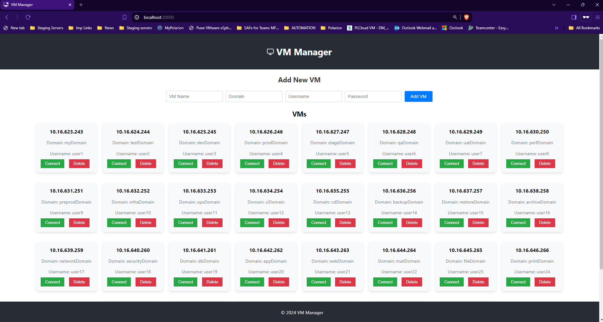
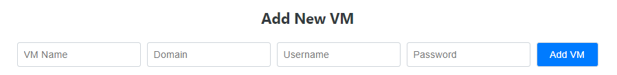
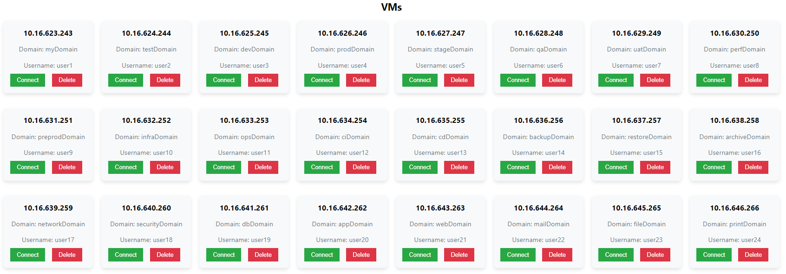

# 🖥️ VM Manager

Welcome to the VM Manager application! This app allows users to manage Virtual Machines (VMs) effortlessly through a user-friendly interface. Users can add, delete, and connect to VMs with ease.

## ✨ Features

- **Add New VM:** Add details for a new VM including name, domain, username, and password.
- **Delete VM:** Remove a VM from the list.
- **Connect to VM:** Connect to a VM using RDP (Remote Desktop Protocol).
- **Real-Time Notifications** using React Toastify 📢

## 📸 Screenshots

### 🏠 Home Page



### ➕ Add New VM



### 📋 VM List



## 🚀 Getting Started

### 📋 Prerequisites

- **Node.js**: Ensure you have Node.js installed. Download from [Node.js](https://nodejs.org/).
- **npm**: Node package manager is required to install dependencies.

### 🛠️ Installation

1.  **Clone the repository:**
    ```bash
    git clone https://github.com/AkshayChandole/vm-manager.git
    cd vm-manager
    ```
2.  **Install server dependencies:**
    ```bash
    cd vm-manager-server
    npm install
    ```
3.  **Install client dependencies:**

    ```bash
    cd vm-manager-client
    npm install
    ```

### ▶️ Running the Application

1.  **Start the server:**
    ```bash
    cd vm-manager-server
    npm run dev
    ```
2.  **Start the client:**
    ```bash
    cd vm-manager-client
    npm start
    ```
3.  **Open your browser and navigate to:** - http://localhost:30000

## 🗂️ Folder Structure

```
`vm-manager/
├── vm-manager-server/
│   ├── config/
│   │   └── VMs.json
│   ├── routes/
│   │   └── vmRoutes.js
│   ├── utils/
│   │   └── fileUtils.js
│   ├── index.js
│   └── package.json
├── vm-manager-client/
│   ├── public/
│   │   └── index.html
│   ├── src/
│   │   ├── components/
│   │   │   ├── VMForm.js
│   │   │   ├── VMList.js
│   │   ├── services/
│   │   │   └── vmService.js
│   │   ├── App.js
│   │   ├── index.js
│   │   ├── App.css
│   └── package.json
├── .gitignore
└── README.md`
```

## 📡 API Endpoints

- **GET /api/vms:** Fetch all VMs.
- **POST /api/vms:** Add a new VM.
- **DELETE /api/vms/:name:** Delete a VM by name.
- **POST /api/vms/connect:** Connect to a VM.

## 💻 Technologies Used

- **Frontend:** React, React Toastify
- **Backend:** Node.js, Express
- **Database:** JSON file (for simplicity)

## 🤝 Contribution

We welcome contributions! Please follow these steps to contribute:

1.  Fork the repository.
2.  Create a new branch (`git checkout -b feature-branch`).
3.  Commit your changes (`git commit -m 'Add some feature'`).
4.  Push to the branch (`git push origin feature-branch`).
5.  Create a new Pull Request.

## 📧 Contact

For any inquiries or feedback, please contact akshaychandole1234@gmail.com.

---
